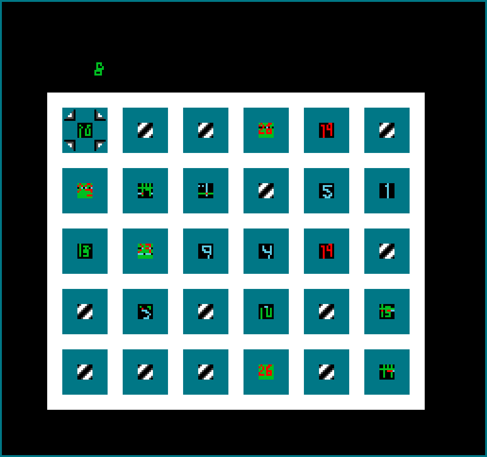

# (TODO: your game's title)

Author: (TODO: your name)

Design: (TODO: In two sentences or fewer, describe what is new and interesting about your game.)

Screen Shot:

How Your Asset Pipeline Works:

(TODO: describe the steps in your asset pipeline, from source files to tiles/backgrounds/whatever you upload to the PPU466.)

How To Play:

* Use the arrow keys or WASD to swap which card you have selected.
* Press 'Space' to flip the current card.
 * Flip 2 matching cards at a time until you've uncovered all pairs.
 * Whenever you flip a card, all adjacent cards will be corrupted.
* Press 'Q' to quit.

Sources: (TODO: list a source URL for any assets you did not create yourself. Make sure you have a license for the asset.)

This game was built with [NEST](NEST.md).

